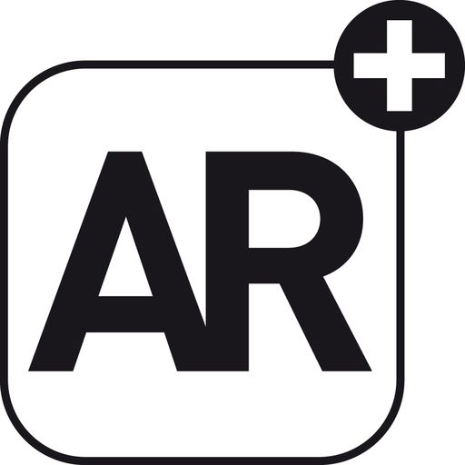

# AR Medicine - Aplicativo de Realidade Aumentada para Medicina



## 📱 Sobre o Projeto

O AR Medicine é um aplicativo mobile inovador desenvolvido com Flutter e ARKit/ARCore que utiliza Realidade Aumentada para facilitar o aprendizado e a visualização de estruturas anatômicas em 3D. Este projeto representa a interseção entre tecnologia e medicina, oferecendo uma ferramenta interativa para estudantes, profissionais de saúde e educadores.

## 🚀 Funcionalidades Principais

- **Visualização 3D Anatômica**: Modelos tridimensionais precisos de órgãos e estruturas do corpo humano
- **Interação em Tempo Real**: Manipulação, rotação e zoom nos modelos 3D através de gestos intuitivos
- **Jornadas de Aprendizado**: Conteúdo organizado em módulos progressivos para facilitar o estudo
- **Sistema de Autenticação**: Login e cadastro de usuários para salvar progresso e personalizar experiências
- **Rastreamento de Progresso**: Acompanhamento do desempenho do usuário em testes e atividades
- **Experiência Offline**: Possibilidade de baixar modelos para visualização sem conexão à internet

## 🔧 Tecnologias Utilizadas

- **Framework**: Flutter
- **Linguagem**: Dart
- **Plugins AR**: ar_flutter_plugin (integração com ARKit e ARCore)
- **Gerenciamento de Estado**: Provider
- **Armazenamento Local**: Shared Preferences
- **Manipulação 3D**: Vector Math
- **UI/UX**: Material Design, Lottie para animações
- **Fontes Personalizadas**: Google Fonts

## 📊 Arquitetura

O projeto segue uma arquitetura limpa com separação clara de responsabilidades:

```
lib/
  ├── core/          # Configurações e constantes do aplicativo
  ├── data/          # Fontes de dados e repositórios 
  ├── models/        # Modelos de dados (User, Jornada, etc.)
  ├── Presentation/  # UI, telas e componentes visuais
  ├── service/       # Serviços e lógicas de negócio
  ├── examples/      # Exemplos de implementação AR
  └── util/          # Utilitários e helpers
```

## 📸 Demonstração

### Vídeo Demonstrativo do Aplicativo em Funcionamento

<div align="center">
  <video width="320" height="640" controls>
    <source src="https://github.com/artaxerxesnazareno/ar_medicine_v2_app/raw/main/assets/ar%20demo.mp4" type="video/mp4">
    Seu navegador não suporta a tag de vídeo.
  </video>
</div>

<div align="center">
  <p><strong>Não consegue visualizar o vídeo?</strong> <a href="https://github.com/artaxerxesnazareno/ar_medicine_v2_app/blob/main/assets/ar%20demo.mp4" target="_blank">Clique aqui para assistir no GitHub</a></p>
</div>


https://github.com/user-attachments/assets/1fdf8353-7690-4eb4-a79c-c4370d28c8ce

https://github.com/artaxerxesnazareno/ar_medicine_v2_app/blob/main/assets/ar%20demo.mp4
### Screenshots do Aplicativo

<div align="center">
  <div style="display: flex; flex-wrap: wrap; justify-content: center; gap: 10px;">
    
    
    
    
    
    
  </div>
</div>

<div align="center">
  <details>
    <summary><strong>Ver mais screenshots</strong></summary>
    <div style="display: flex; flex-wrap: wrap; justify-content: center; gap: 10px; margin-top: 15px;">
      
      
      
      
      
    </div>
  </details>
</div>

## 💡 Desafios e Soluções

Durante o desenvolvimento deste projeto, enfrentei diversos desafios técnicos:

1. **Otimização de Modelos 3D**: Trabalhei na redução da complexidade dos modelos para garantir desempenho fluido em dispositivos com recursos limitados.

2. **Rastreamento de Superfícies**: Implementei algoritmos avançados para melhorar a detecção e o posicionamento preciso dos objetos virtuais no mundo real.

3. **Compatibilidade entre Plataformas**: Assegurei uma experiência consistente entre iOS (ARKit) e Android (ARCore), superando as diferenças de implementação entre essas tecnologias.

4. **Gestão de Memória**: Desenvolvi um sistema eficiente para carregar e descarregar modelos 3D, evitando vazamentos de memória durante o uso prolongado.

## 🔜 Próximos Passos

- Integração com recursos de colaboração em tempo real
- Expansão da biblioteca de modelos anatômicos
- Implementação de recursos de anotação em AR
- Suporte para reconhecimento de imagens como gatilhos para modelos específicos

## 🛠️ Como Executar o Projeto

```bash
# Clone este repositório
git clone https://github.com/artaxerxesnazareno/ar_medicine_v2_app.git

# Navegue até o diretório do projeto
cd ar_medicine

# Instale as dependências
flutter pub get

# Execute o aplicativo (certifique-se de ter um dispositivo compatível com AR conectado)
flutter run
```

## 📝 Requisitos

- Flutter 2.19.0 ou superior
- Dispositivo com suporte a ARKit (iOS 11+) ou ARCore (Android 7.0+)
- Câmera funcional
- Sensores de movimento (acelerômetro, giroscópio)

## 👤 Desenvolvedor

Desenvolvido por [Seu Nome] - [Seu LinkedIn/GitHub]

## 📄 Licença

Este projeto está sob a licença MIT - veja o arquivo LICENSE para detalhes. 
